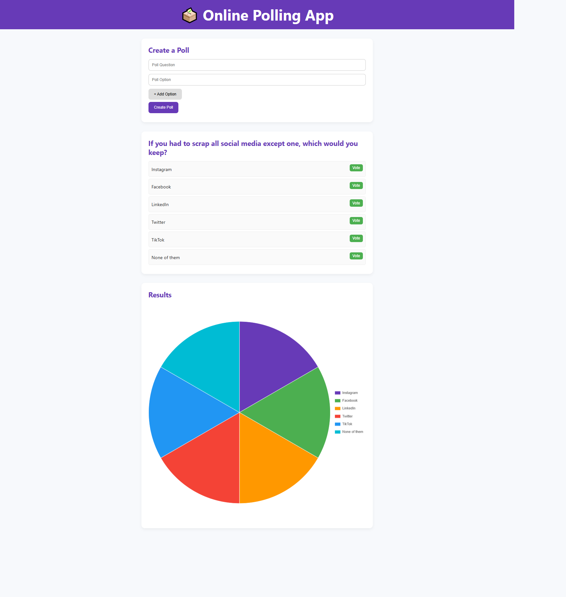

# 🗳️ Online Polling App

An interactive **Polling / Voting App** by **Ramesh R**.  
Users can create a poll, add options, vote, and see results live in a chart.

## 🚀 Features
- Create a custom poll with multiple options
- Vote on poll options
- See real-time results in a chart
- Delete options before finalizing poll
- Responsive, modern UI

## 🛠️ Tech Stack
- **HTML5**
- **CSS3**
- **JavaScript (ES6)**
- **Chart.js** (for live results visualization)

## 📸 Screenshots


## 🚀 Getting Started
1. Clone the repo:
   ```bash
   git clone https://github.com/ramesh-852000/polling-app.git
